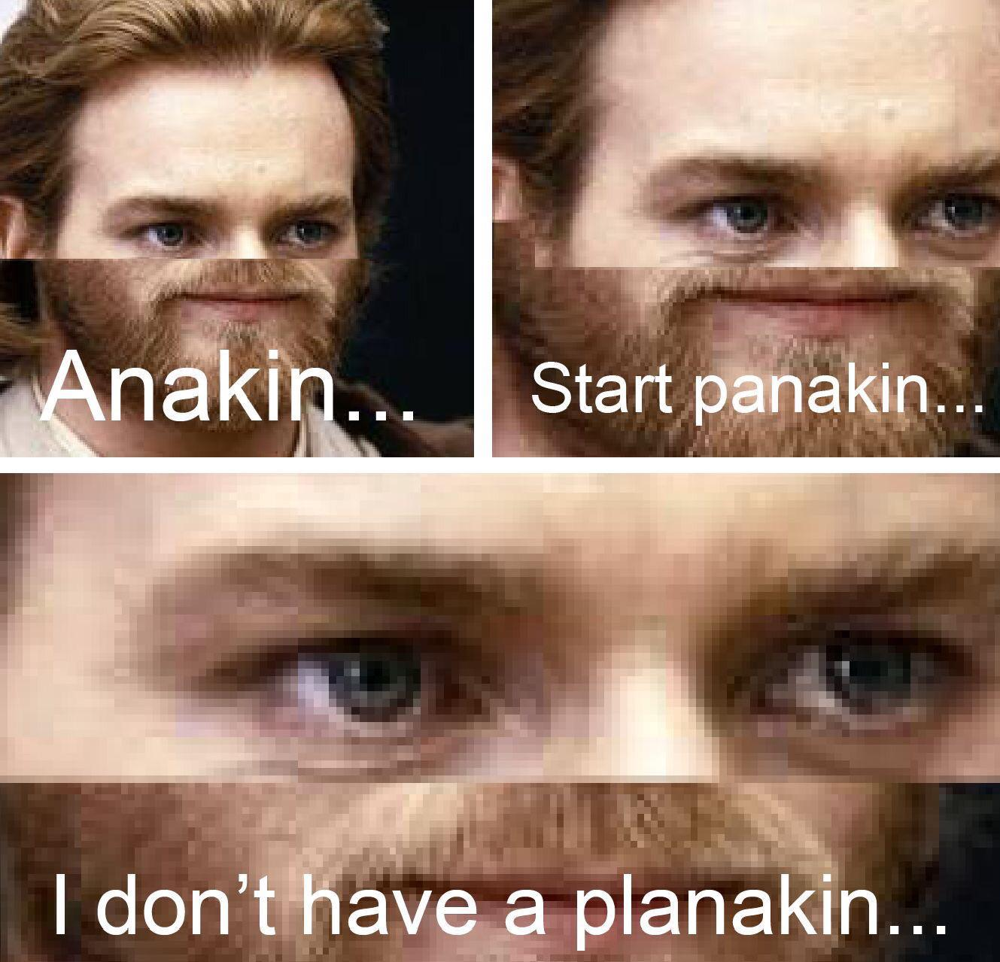

# test plan weeeeeee

# check maize

- 5 <= width/height <= 100
- every single row same length
- every single col same length
- only has allowed chars (#, ' ', S, E)

# check player

- walk normally
- walk off the map
- walk into wall
- reach E
- walk into negative tile

# check input

- no args
- enter every char in selection
- enter char out of selection
- enter number
- enter very long string

# check map

- press M
